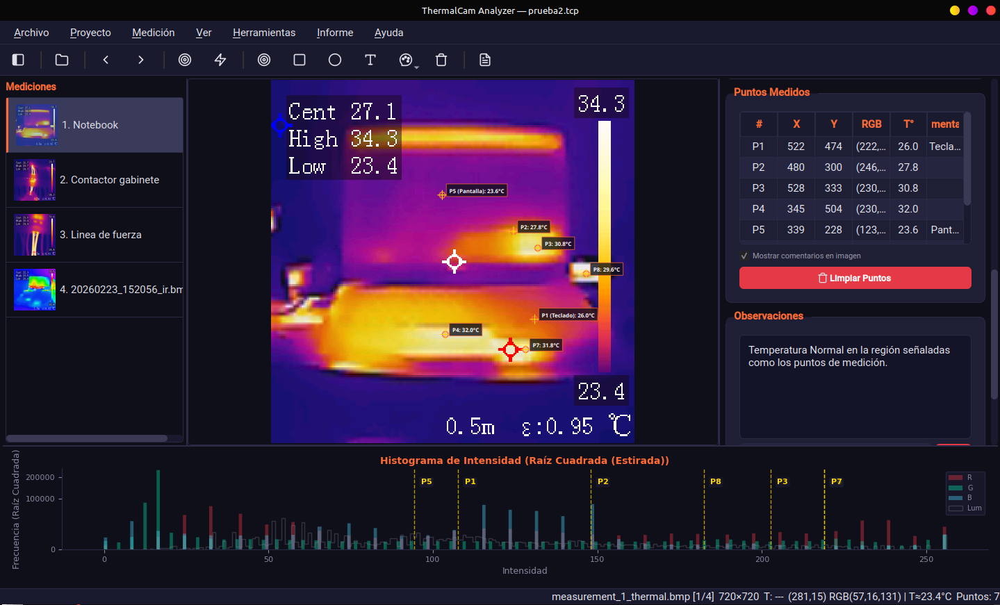
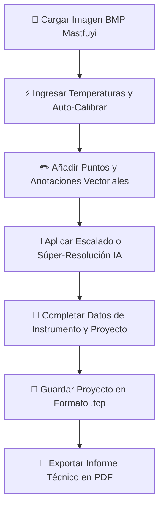

# 📸 ThermalCam Analyzer v1.1



**ThermalCam Analyzer** es un software profesional de escritorio, multiplataforma, desarrollado en Python y PyQt6, diseñado específicamente para la decodificación, visualización interactiva, análisis térmico cuantitativo y mejora de resolución por Inteligencia Artificial (Súper-Resolución) de imágenes capturadas con cámaras termográficas (como la serie **Mastfuyi** y compatibles).

La **Versión 1.1** introduce el revolucionario formato de archivo de proyectos unificado `.tcp` multi-medición, un panel avanzado de control de instrumentación, soporte optimizado para redes neuronales de súper-resolución y un generador de informes técnicos en PDF de alta fidelidad.

---

## 🚀 Características Principales (v1.1)

### 1. 🔌 Decodificador Crudo BMP RGB565 (Mastfuyi)
* **Compatibilidad Exclusiva**: Parser nativo de imágenes térmicas BMP Mastfuyi de 16-bits (con cabecera especial `BITMAPV3INFOHEADER` de 56 bytes). Resuelve el problema donde visores tradicionales, OpenCV o PIL fallan en leer el formato, arrojando imágenes distorsionadas o ruidosas.
* **Extracción de Termografía**: Extrae la información de color real de la matriz activa sin pérdida de datos cromáticos.

### 2. 📁 Formato de Proyecto Multi-Medición v1.1 (`.tcp`)
* **Contenedor Comprimido**: Los proyectos se empaquetan en un archivo ZIP con extensión `.tcp` que consolida todo el trabajo.
* **Multi-Medición**: Permite guardar en un solo proyecto múltiples capturas térmicas independientes, cada una con su propia configuración de calibración, anotaciones, imagen real e imagen escalada.
* **Guardado Inteligente**: Almacena las imágenes térmicas originales, imágenes reales, logotipos del cliente y las imágenes súper-escaladas (bajo la nomenclatura `[original]_upscaler.png`), garantizando que al abrir el proyecto en cualquier computadora, los marcadores y anotaciones calcen exactamente sobre la matriz escalada sin sufrir desajustes.

### 3. ⚡ Mapeo Térmico y Auto-Calibración
* **Auto-Cal**: Algoritmo inteligente que realiza el recorte automático de la barra de color (*trimming*) para descartar bordes, calibrando la escala cromática píxel a píxel.
* **Medición Cuantitativa**: Permite conocer la temperatura exacta estimada en cualquier píxel haciendo simplemente clic sobre el área térmica.
* **Control Ambiental**: Parámetros de emisividad, distancia de medición y temperatura ambiente integrados individualmente por cada toma térmica.

### 4. 🧠 Súper-Resolución Térmica por Inteligencia Artificial (IA)
* **Modelos Neuronales**: Backend de inferencia convolucional que incluye modelos entrenados **FSRCNN** y **ESPCN** (factores de escala $\times2$, $\times3$ y $\times4$).
* **Fidelidad Térmica**: Incrementa la definición geométrica y suaviza gradientes térmicos sin alterar las lecturas de calibración originales.
* **Métodos Clásicos**: Conserva métodos de interpolación tradicionales de alto rendimiento (Bicúbica, Lanczos).

### 5. ✏️ Suite de Anotación Vectorial e Interactiva
* **Herramientas de Dibujo**: Puntos de medición automáticos (`P1`, `P2`...), rectángulos y círculos con rellenos translúcidos, e inserción de notas de texto libre.
* **Color de Alto Contraste**: Selector de color integrado en la barra de herramientas para destacar las marcas sin importar si el fondo es una zona fría (azul/púrpura) o caliente (amarillo/rojo).
* **Escalado Vectorial Coherente**: Si cambias el método de escalado o aplicas súper-resolución, todas las anotaciones y marcadores se recalculan vectorialmente de forma instantánea manteniendo sus posiciones físicas relativas perfectas.

### 6. 🛠️ Control de Instrumentación e Información de Proyecto
* **Ficha Técnica de Cámara**: Menú dedicado para registrar Marca, Modelo y Número de Serie de la cámara termográfica utilizada.
* **Metadatos de Auditoría**: Permite ingresar Título, Autor, Cliente, Ubicación, e Imagen de Equipo analizado, almacenándolos directamente dentro del archivo de proyecto `.tcp`.
* **Identificador de Auditoría**: Campo dedicado para registrar el número o código único del **"Informe:"**, facilitando la trazabilidad administrativa.
* **Observaciones del Proyecto**: Diálogo de texto multilínea para consignar las observaciones, alcances y comentarios generales de la inspección de manera global.

### 7. 📄 Generador de Informes PDF de Alta Fidelidad
* **Estructura Multicapa**: Reportes multipágina de diseño limpio con cabecera corporativa, logotipo dinámico, y datos técnicos de auditoría e instrumentos.
* **Numeración Correlativa de Figuras**: Sistema dinámico que numera de forma consecutiva todas las figuras del reporte técnico (`Fig 1 : Imagen Termográfica`, `Fig 2 : Imagen Real`, `Fig 3 : Imagen con Super-resolución...`), evitando repeticiones y ofreciendo un informe formal.
* **Páginas e Imágenes Snug**: Layout de imágenes centrado y apilado con pies de imagen ceñidos estrictamente a la base mediante espaciados precisos de 1.5mm y 3.0mm, garantizando un acabado premium libre de grandes espacios vacíos.
* **Formatos de Página Ajustables**: Selector interactivo de tamaño de papel (**A4**, **Carta / Letter**, **Oficio / Legal**) con recalculado matemático dinámico de encabezados, líneas separadoras y márgenes usando `pdf.w`.
* **Pies de Página Automatizados**: Inserción constante del pie de página de la suite y número de página en *todas* las hojas (incluyendo la portada de forma uniforme).
* **Foto de Campo Real**: Espacio dedicado para agregar opcionalmente la imagen real/óptica del equipo tomada con cámara convencional.
* **Tabla de Mediciones**: Generación automática de tablas que resumen las lecturas de los puntos marcados (`P1`, `P2`, etc.) con sus respectivas temperaturas, emisividad y observaciones del inspector.
* **Codificación Robusta**: Compatibilidad total con la codificación de fuentes en PDF (evitando caídas por caracteres no estándar).

---

## 📂 Estructura del Repositorio

```text
termalcam/
├── main.py                      # Punto de entrada para ejecutar la app
├── requirements.txt             # Dependencias de Python requeridas
├── LICENSE                      # Licencia MIT de Código Abierto
├── README.md                    # Manual de documentación general
├── TCP_FORMAT.md                # Especificación técnica del formato de archivo .tcp
├── ANALYSIS_AND_SCALING.md      # Detalles del análisis térmico y el escalado IA
├── resources/                   # Recursos visuales e iconografía
│   ├── logo.png                 # Logotipo corporativo de la aplicación
│   └── icons/                   # Suite de iconos SVG de alto contraste (target, rect, circle, etc.)
├── models/                      # Modelos pre-entrenados de Redes Neuronales de Súper-Resolución
└── app/                         # Código fuente de la lógica y la UI de la aplicación
    ├── __init__.py
    ├── main_window.py           # Ventana principal e integración de componentes PyQt6
    ├── image_viewer.py          # Lienzo gráfico vectorial interactivo (QGraphicsView)
    ├── thermal_analyzer.py      # Lógica de decodificación BMP, calibración térmica y LUTs
    ├── upscaler.py              # Inferencia convolucional y escalado de imágenes
    ├── sidebar_panel.py         # Panel lateral derecho (Calibración, Escalado, Mediciones)
    ├── project_dialogs.py       # Diálogos de información de proyecto e instrumento técnico
    ├── report_dialog.py         # Configuración y generación de informes PDF profesionales
    ├── histogram_widget.py      # Visualizador de histograma Matplotlib para distribución térmica
    └── styles.py                # Hoja de estilos QSS premium con tema oscuro "Glassmorphism"
```

---

## 📦 Requisitos e Instalación

Este proyecto requiere **Python 3.8 o superior**.

### 1. Clonar el repositorio
```bash
git clone https://github.com/tu-usuario/termalcam.git
cd termalcam
```

### 2. Instalar dependencias
Se recomienda utilizar un entorno virtual para mantener limpias las dependencias:
```bash
# Crear entorno virtual
python3 -m venv .venv

# Activar entorno virtual
# En Linux/macOS:
source .venv/bin/activate
# En Windows (CMD):
.venv\Scripts\activate.bat

# Instalar dependencias
pip install -r requirements.txt
```

> [!NOTE]
> Las dependencias instaladas incluyen:
> * `PyQt6` (Interfaz de usuario premium de escritorio)
> * `opencv-contrib-python` (Procesamiento de imágenes y backend de inferencia DNN para modelos de IA)
> * `numpy` (Álgebra matricial de alto rendimiento)
> * `matplotlib` (Renderizado del histograma térmico)
> * `fpdf2` (Generación de PDF multipágina sin dependencias externas)
> * `Pillow` (Operaciones auxiliares de codificación de imágenes)

---

## 🖥️ Cómo Ejecutar la Aplicación

Con el entorno virtual activado, ejecuta el archivo de entrada:

```bash
python3 main.py
```

---

## 📖 Guía de Uso del Flujo de Trabajo Profesional



1. **Cargar Captura Térmica**: Haz clic en el botón **📂** (`Ctrl + O`) para abrir una imagen BMP de 16-bits Mastfuyi.
2. **Establecer Escala**: En el panel lateral, introduce las temperaturas mínima y máxima impresas originalmente por la cámara en la barra de color lateral, y presiona **⚡ Auto-Cal**. La aplicación calibrará dinámicamente la escala y te permitirá saber la temperatura en cualquier coordenada al pasar o hacer clic con el mouse.
3. **Anotar Detalles Críticos**:
   * Activa el modo **Puntos (🎯)** para marcar puntos calientes/fríos específicos. La aplicación les asignará una etiqueta incremental con su temperatura calculada automáticamente.
   * Utiliza **Rectángulo (⬜)** o **Círculo (◯)** para encerrar componentes bajo sospecha de falla.
   * Selecciona un color llamativo (como amarillo brillante o verde cian) con el **Pincel (🎨)** para que resalte.
4. **Mejorar Definición (IA)**: Elige el modelo neuronal **FSRCNN** o **ESPCN** en el desplegable de súper-resolución lateral, selecciona un factor de multiplicación ($\times2$, $\times3$ o $\times4$) y haz clic en **Aplicar**. El software regenerará la imagen con bordes definidos y alta resolución.
5. **Completar Ficha Técnica**: Ve a los menús superiores:
   * **Proyecto -> Información**: Modifica el título, cliente, autor, añade el logotipo de tu empresa y una imagen de campo óptica opcional.
   * **Proyecto -> Instrumento**: Configura la marca, modelo y serie de tu cámara térmica para que conste en el informe.
6. **Guardar el Trabajo**: Pulsa en **Guardar Proyecto** (`Ctrl + S`) para empaquetarlo en el formato `.tcp` y asegurar que toda la información técnica quede resguardada.
7. **Exportar Reporte**: Pulsa el botón **Generar Informe** (`Ctrl + P`) para abrir el configurador. Modifica las observaciones generales de la inspección y pulsa **Generar PDF** para obtener un reporte listo para entregar al cliente.

---

## 🤝 Créditos y Comunidad

**ThermalCam Analyzer v1.1** ha sido desarrollado con el firme compromiso de proveer herramientas de ingeniería electrónica accesibles y de nivel profesional.

* **Desarrollador Principal**: Vito
* **Agradecimientos Especiales**: Dedicado a toda la **comunidad Naseriana**.

---

*Este proyecto está licenciado bajo los términos de la Licencia MIT. Siéntete libre de abrir issues, proponer mejoras o enviar Pull Requests para contribuir al desarrollo.*
